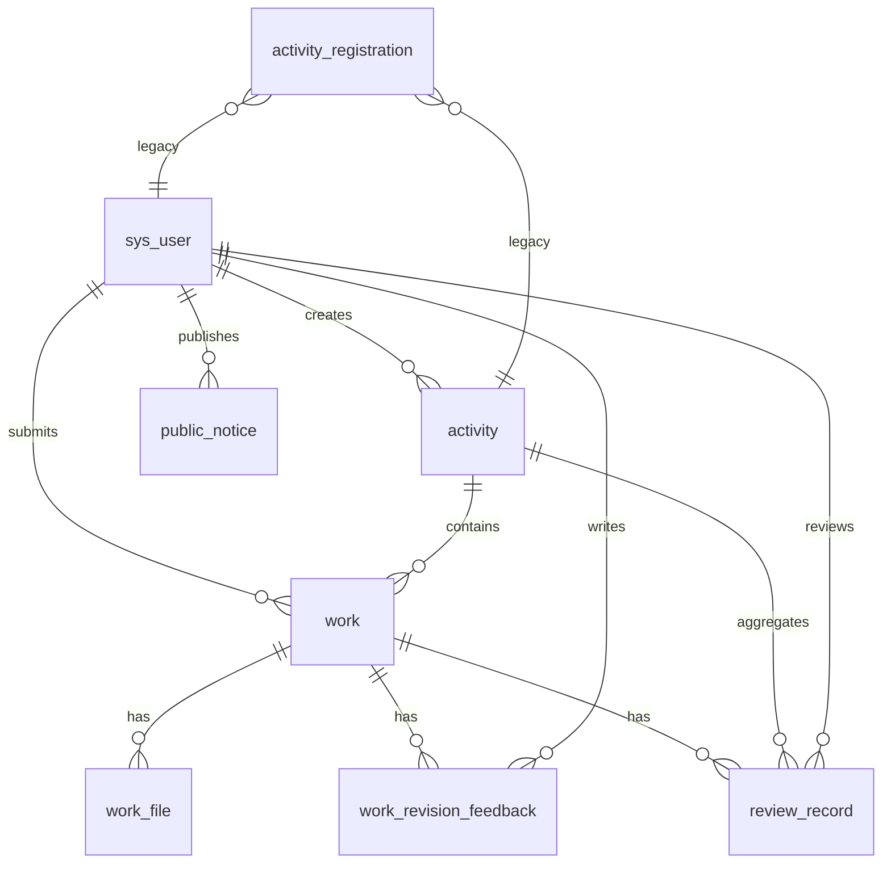

# 数据库改造方案：Workflow 多级作品流程

> **依据：** [`workflow-spec.md`](./workflow-spec.md)、[`gap-analysis.md`](./gap-analysis.md)、[`database-design.md`](./database-design.md)  
> **迁移脚本：** [`db/migration-workflow.sql`](../db/migration-workflow.sql)（**勿自动执行**，审核后手动运行）  
> **状态：** 待 Review | 最后更新：2026-06-07

---

## 1. 改造目标

在**保留现有 `activity`、`sys_user`、`activity_registration` 表及数据**的前提下，通过 `ALTER TABLE` 扩展活动表，并**新增**作品流程相关 5 张表，支撑：

- 教师作品（`work`）+ 附件（`work_file`）
- 审核退回意见（`work_revision_feedback`）
- 审核/打分记录（`review_record`）
- 结果公示（`public_notice`）

### 1.1 设计原则（api-and-interface-design）

| 原则 | 应用 |
|------|------|
| 契约优先 | 表字段与 `workflow-spec` 枚举、Service 边界一一对应 |
| 加法优于修改 | 保留 `activity` 既有列（`description`、`max_count` 等），仅 ADD 列 |
| 边界校验 | CHECK 约束限制枚举；应用层仍须二次校验 |
| 命名稳定 | DB `snake_case`；Java `camelCase`；文档给出映射 |

### 1.2 安全原则（security-and-hardening）

| 项 | 措施 |
|----|------|
| 外键 | 全部 `ON DELETE RESTRICT`，防级联误删 |
| 文件元数据 | `work_file` 仅存 URL/类型/大小，不存二进制；`file_type` 白名单由 UploadService 校验 |
| 辖区字段 | `province_name` 等由服务端从登录用户 scope 写入，禁止客户端随意篡改 |
| 公示内容 | `content` 输出时 HTML 转义；管理端录入需 XSS 过滤 |
| 迁移脚本 | 不含密钥；生产执行前备份 |

---

## 2. 现状与改造策略

### 2.1 已有表（不 DROP）

| 表 | 策略 |
|----|------|
| `sys_user` | 本迁移**不修改**（scope/8 角色见后续 `migration-user-scope.sql`） |
| `activity` | **ALTER TABLE** 增列 + 状态值迁移 `OFFLINE→CLOSED` |
| `activity_registration` | **保留**；与 `work` 并存，数据迁移另脚本 |

### 2.2 新增表

`work`、`work_file`、`work_revision_feedback`、`review_record`、`public_notice`

### 2.3 命名映射（规格名 → 现有列）

| 规格/文档名 | 现有 DB 列 | 说明 |
|-------------|------------|------|
| `name` / 活动名称 | `title` | **保留 `title`**，不新增 `name` |
| `create_user_id` | `created_by` | **保留 `created_by`** |
| `create_time` | `created_at` | **保留 `created_at`** |
| `update_time` | `updated_at` | **保留 `updated_at`** |
| `status CLOSED` | `OFFLINE` | 数据迁移为 `CLOSED`，应用层枚举同步 |

---

## 3. 表结构设计

### 3.1 `activity`（ALTER 扩展）

#### 3.1.1 必选字段对照

| 要求字段 | 处理 | 类型 | 说明 |
|----------|------|------|------|
| `id` | 已有 | BIGINT PK | — |
| `name` / `title` | 已有 `title` | VARCHAR(200) | 活动标题 |
| `status` | 已有，**改枚举** | VARCHAR(20) | `DRAFT` / `PUBLISHED` / `CLOSED` |
| `signup_start_time` | 已有 | DATETIME(3) | 报名开始 |
| `signup_end_time` | 已有 | DATETIME(3) | 报名截止 |
| `upload_deadline` | **新增** | DATETIME(3) NULL | 作品上传截止；NULL 表示与 `signup_end_time` 一致（应用层默认） |
| `create_user_id` | 已有 `created_by` | BIGINT FK | → `sys_user.id` |
| `create_time` | 已有 `created_at` | DATETIME(3) | — |
| `update_time` | 已有 `updated_at` | DATETIME(3) | — |

#### 3.1.2 保留的 MVP 字段（不删除）

`description`, `location`, `start_time`, `end_time`, `max_count`, `current_count` — 供名额控制与现有 API 兼容。

#### 3.1.3 状态迁移

```text
DRAFT      → 不变
PUBLISHED  → 不变
OFFLINE    → CLOSED   （UPDATE 后应用层改用 CLOSED）
```

#### 3.1.4 新增约束

- `chk_activity_status_v2`：`status IN ('DRAFT','PUBLISHED','CLOSED')`
- `chk_activity_upload_deadline`：`upload_deadline IS NULL OR signup_end_time <= upload_deadline`

---

### 3.2 `work`（新建）

#### 3.2.1 字段

| 字段 | 类型 | 空 | 默认 | 说明 |
|------|------|----|------|------|
| `id` | BIGINT UNSIGNED | N | AUTO | PK |
| `activity_id` | BIGINT UNSIGNED | N | — | FK → `activity.id` |
| `teacher_id` | BIGINT UNSIGNED | N | — | FK → `sys_user.id` |
| `title` | VARCHAR(200) | N | — | 作品标题 |
| `category` | VARCHAR(100) | Y | NULL | 作品类别 |
| `equipment` | VARCHAR(200) | Y | NULL | 使用设备 |
| `duration` | INT UNSIGNED | Y | NULL | 时长（秒） |
| `province_name` | VARCHAR(100) | N | — | 省（辖区隔离） |
| `city_name` | VARCHAR(100) | N | — | 市 |
| `district_name` | VARCHAR(100) | N | — | 区/县 |
| `school_name` | VARCHAR(200) | N | — | 校 |
| `current_step` | VARCHAR(32) | N | `SCHOOL` | 见 §4.1 |
| `current_status` | VARCHAR(32) | N | `DRAFT` | 见 §4.2 |
| `final_score` | DECIMAL(8,2) | Y | NULL | 终局分数（汇总后回写） |
| `final_result` | VARCHAR(32) | N | `PENDING` | 见 §4.3 |
| `deleted` | TINYINT | N | `0` | 软删：`0` 正常 `1` 已删 |
| `created_at` | DATETIME(3) | N | CURRENT_TIMESTAMP(3) | 创建时间 |
| `updated_at` | DATETIME(3) | N | ON UPDATE | 更新时间 |

#### 3.2.2 唯一约束（非删除状态不重复报名）

采用 MySQL 8 **生成列 + 唯一索引**（与 `work_file.deleted` 语义一致）：

```sql
active_teacher_id  GENERATED ALWAYS AS (IF(deleted = 0, teacher_id, NULL)) STORED
active_activity_id GENERATED ALWAYS AS (IF(deleted = 0, activity_id, NULL)) STORED
UNIQUE KEY uk_work_teacher_activity_active (active_teacher_id, active_activity_id)
```

- `deleted = 0`：同一 `(teacher_id, activity_id)` 仅一条
- `deleted = 1`：生成列为 NULL，允许多条历史删除记录；教师可再次报名（插入新行）

#### 3.2.3 索引（必选）

| 索引名 | 字段 |
|--------|------|
| `idx_work_activity_id` | `activity_id` |
| `idx_work_teacher_id` | `teacher_id` |
| `idx_work_step_status` | `current_step`, `current_status` |
| `idx_work_scope` | `province_name`, `city_name`, `district_name`, `school_name` |

---

### 3.3 `work_file`（新建）

| 字段 | 类型 | 空 | 默认 | 说明 |
|------|------|----|------|------|
| `id` | BIGINT UNSIGNED | N | AUTO | PK |
| `work_id` | BIGINT UNSIGNED | N | — | FK → `work.id` |
| `file_name` | VARCHAR(255) | N | — | 原始文件名 |
| `file_url` | VARCHAR(500) | N | — | 存储路径/URL（禁止 `../`） |
| `file_type` | VARCHAR(50) | N | — | MIME 或扩展名 |
| `file_size` | BIGINT UNSIGNED | N | — | 字节 |
| `deleted` | TINYINT | N | `0` | 软删 |
| `created_at` | DATETIME(3) | N | CURRENT_TIMESTAMP(3) | 上传时间 |

**索引：** `idx_work_file_work_id (work_id)`，`idx_work_file_work_deleted (work_id, deleted)`

**安全：** `file_size` 上限由应用配置（建议 ≤ 52428800）；`file_type` 白名单校验在 UploadService。

---

### 3.4 `work_revision_feedback`（新建）

| 字段 | 类型 | 空 | 说明 |
|------|------|----|------|
| `id` | BIGINT UNSIGNED | N | PK |
| `work_id` | BIGINT UNSIGNED | N | FK → `work.id` |
| `review_step` | VARCHAR(32) | N | 退回时所在 step |
| `round_no` | INT UNSIGNED | N | 退回轮次，从 1 递增 |
| `feedback` | VARCHAR(2000) | N | 退回意见 |
| `reviewer_id` | BIGINT UNSIGNED | N | FK → `sys_user.id` |
| `created_at` | DATETIME(3) | N | 创建时间 |

**索引：** `idx_wrf_work_id (work_id)`，`idx_wrf_work_step (work_id, review_step)`

---

### 3.5 `review_record`（新建）

| 字段 | 类型 | 空 | 说明 |
|------|------|----|------|
| `id` | BIGINT UNSIGNED | N | PK |
| `work_id` | BIGINT UNSIGNED | N | FK → `work.id` |
| `activity_id` | BIGINT UNSIGNED | N | FK → `activity.id`（冗余，便于按活动统计） |
| `reviewer_id` | BIGINT UNSIGNED | N | FK → `sys_user.id` |
| `review_level` | VARCHAR(32) | N | 审核/打分级别（与 step 对齐） |
| `manual_score` | DECIMAL(8,2) | Y | 人工分 |
| `ai_score` | DECIMAL(8,2) | Y | AI 辅助分（可选） |
| `final_score` | DECIMAL(8,2) | Y | 该条记录最终分 |
| `result` | VARCHAR(32) | Y | 如 `APPROVED`/`REVISION`/`ELIMINATED`/`PROMOTED` |
| `created_at` | DATETIME(3) | N | 创建时间 |

#### 唯一约束（必选）

```sql
UNIQUE KEY uk_review_work_level_reviewer (work_id, review_level, reviewer_id)
```

同一评委对同一作品在同一级别只能打一次分/审一次。

#### 索引（必选）

| 索引名 | 字段 |
|--------|------|
| `idx_review_work_level` | `work_id`, `review_level` |
| `idx_review_reviewer_level` | `reviewer_id`, `review_level` |

---

### 3.6 `public_notice`（新建）

| 字段 | 类型 | 空 | 说明 |
|------|------|----|------|
| `id` | BIGINT UNSIGNED | N | PK |
| `title` | VARCHAR(200) | N | 公示标题 |
| `content` | TEXT | N | 公示正文 |
| `notice_type` | VARCHAR(32) | N | 如 `REVIEW_RESULT` / `SCORE_RESULT` / `AWARD_LIST` |
| `visible_scope_type` | VARCHAR(32) | N | `PROVINCE`/`CITY`/`DISTRICT`/`SCHOOL`/`PUBLIC` |
| `province_name` | VARCHAR(100) | Y | 可见辖区 |
| `city_name` | VARCHAR(100) | Y | |
| `district_name` | VARCHAR(100) | Y | |
| `school_name` | VARCHAR(200) | Y | |
| `created_by` | BIGINT UNSIGNED | N | FK → `sys_user.id`（规格 `create_user_id`） |
| `publish_time` | DATETIME(3) | Y | 发布时间；NULL 表示草稿 |
| `created_at` | DATETIME(3) | N | 创建时间 |
| `updated_at` | DATETIME(3) | N | 更新时间 |

**索引：** `idx_notice_publish (publish_time)`，`idx_notice_scope (visible_scope_type, province_name, city_name)`

---

## 4. 枚举定义（DB CHECK）

### 4.1 `work.current_step`

`SCHOOL`, `DISTRICT`, `CITY`, `PROVINCE`, `SCORE_DISTRICT`, `SCORE_CITY`, `SCORE_PROVINCE`, `COMPLETED`

### 4.2 `work.current_status`

`DRAFT`, `SUBMITTED`, `REVISION_REQUIRED`, `APPROVED`

### 4.3 `work.final_result`

`PENDING`, `PROMOTED`, `ELIMINATED`, `AWARD`, `NOT_AWARDED`

### 4.4 `activity.status`（改造后）

`DRAFT`, `PUBLISHED`, `CLOSED`

---

## 5. ER 关系



---

## 6. 迁移执行计划

### 6.1 顺序

1. **备份**数据库
2. 执行 `db/migration-workflow.sql`
3. 验证 §7 检查项
4. 同步后端枚举：`ActivityStatus.OFFLINE` → `CLOSED`
5. （可选）后续脚本：从 `activity_registration` 迁移至 `work`

### 6.2 回滚策略

| 步骤 | 回滚 |
|------|------|
| 新增表 | `DROP TABLE` 五张新表（无依赖旧数据） |
| `activity.upload_deadline` | `ALTER TABLE activity DROP COLUMN upload_deadline` |
| `OFFLINE→CLOSED` | `UPDATE activity SET status='OFFLINE' WHERE status='CLOSED'` |

新表有 FK 指向 `activity`/`sys_user`，回滚前须先 DROP 子表。

### 6.3 与应用代码的衔接

| 变更 | 应用动作 |
|------|----------|
| `CLOSED` 替代 `OFFLINE` | 更新 `ActivityStatus` 枚举、前端文案 |
| 新增 `upload_deadline` | ActivityService 校验上传窗口 |
| `work` 表 | 新建 WorkService，逐步替代 RegistrationService |
| `activity_registration` 保留 | 双写或只读兼容期 |

---

## 7. 迁移后验证清单

- [ ] `activity` 存在 `upload_deadline`；`OFFLINE` 行已变为 `CLOSED`
- [ ] 五张新表创建成功，字符集 `utf8mb4`
- [ ] `uk_work_teacher_activity_active`：同一教师同一活动仅一条 `deleted=0`
- [ ] `uk_review_work_level_reviewer`：重复插入同评委同级别失败
- [ ] 索引 `idx_work_step_status`、`idx_work_scope`、`idx_review_*` 存在
- [ ] 外键 RESTRICT 生效
- [ ] 现有 `activity_registration` 数据未丢失

---

## 8. 质量审查摘要（code-review-and-quality）

| 轴 | 结论 |
|----|------|
| Correctness | 字段覆盖用户清单；唯一约束满足「非删除不重复报名」「评委单次打分」 |
| Architecture | 新表与 workflow-spec 对齐；旧表 ALTER 不破坏 MVP |
| Security | FK RESTRICT；文件元数据分离；scope 字段供 Matcher 过滤 |
| Performance | 必选索引已覆盖列表/审核/辖区查询 |
| Readability | 保留既有列名，文档映射清晰 |

**结论：** 方案可进入迁移脚本 Review；执行前须备份并完成 §6.3 应用层枚举同步计划。

---

## 9. 文档关系

```
docs/workflow-spec.md           → 业务枚举与流程
docs/gap-analysis.md            → 现状差距
docs/database-design.md         → MVP 三表设计
docs/database-workflow-design.md → 本文档
db/init.sql                     → 基线 DDL
db/migration-workflow.sql       → 增量迁移
```

---

*版本：1.0.0 | 仅文档与 SQL，未执行任何数据库变更*
