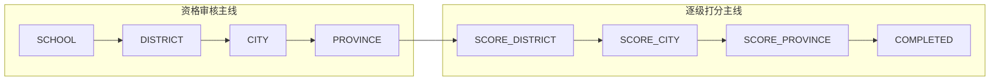
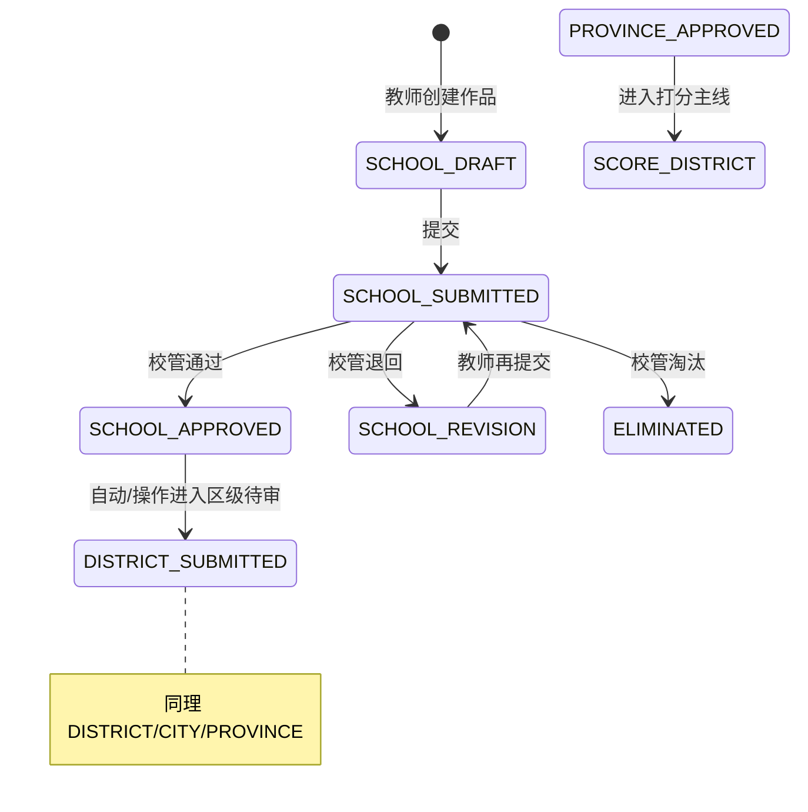
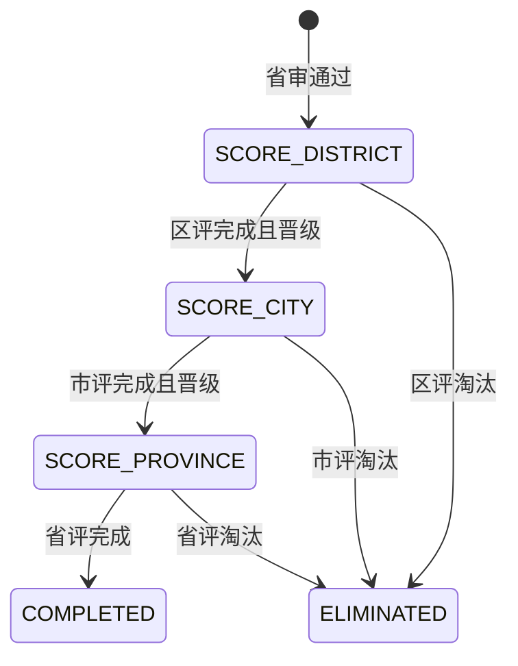
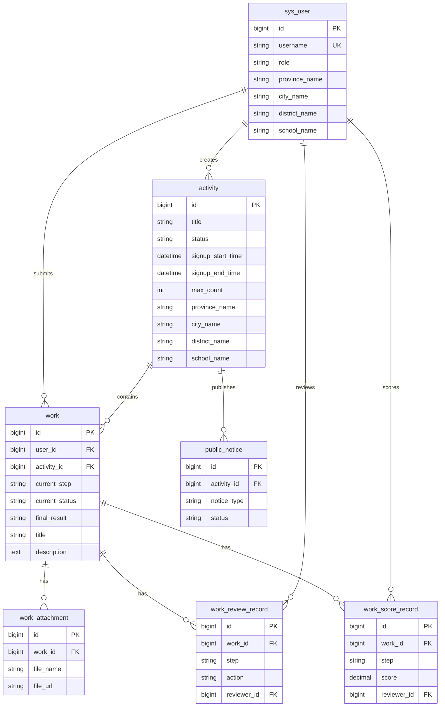

# 系统业务规格：多级作品报名 · 资格审核 · 逐级打分

> **文档类型：** Specify（业务规格，实现前共享事实来源）  
> **适用范围：** 教师作品类竞赛/活动报名管理系统（目标架构）  
> **关联文档：** [`project-context.md`](./project-context.md)、[`requirement.md`](./requirement.md)、[`api-contract.md`](./api-contract.md)、[`database-design.md`](./database-design.md)  
> **状态：** 待 Review | 最后更新：2026-06-07

---

## 0. 文档说明

### 0.1 目标

本文档定义**目标业务系统**的完整工作流规格，涵盖：

- 作品（Work）由 `current_step` + `current_status` 双字段驱动的状态机
- 报名资格审核四级链路：校 → 区 → 市 → 省
- 逐级打分三级链路：区评 → 市评 → 省评 → 完成
- 多角色、多辖区隔离、公示与教师端状态文案

### 0.2 与现有代码库关系

| 维度 | 目标规格（本文档） | 当前代码库（`e:\rpskilldeom`） |
|------|-------------------|-------------------------------|
| 核心实体 | `activity` + `work` + 审核/打分/公示记录 | `activity` + `activity_registration` |
| 角色 | 8 种业务角色 + 辖区 | `USER` / `ADMIN` 两种 |
| 流程 | 双主线（资格审核 + 打分） | 单级报名 + 管理员审核 |
| 已实现 Service | 见各节「现状映射」 | `ActivityService`、`RegistrationService`、`AuthService`、`ActivityQuotaService` |

> **重要：** 本文档描述**应实现的业务逻辑**。未在代码中出现的类/表/枚举，按规格设计；与现有实现冲突之处见 [§15 代码与规格冲突点](#15-代码与规格冲突点)。

### 0.3 假设（实现前请确认）

1. 系统为 Web 应用，前后端分离，REST + JSON。
2. 辖区以**名称字符串**匹配（省/市/区/校四级），见 `ScopeNameMatcher`。
3. 同一教师对同一活动仅允许一条有效作品（Work），与现有「一用户一活动一条报名」语义一致。
4. 资格审核「通过」后进入下一 `current_step`；「退回修改」不改变 `current_step`，仅改 `current_status`。
5. 省级资格审核通过后，作品进入打分主线，初始 `current_step = SCORE_DISTRICT`。
6. 时区：服务端 `LocalDateTime`，展示层本地化。

---

## 1. 整体流程

### 1.1 双主线概览

作品生命周期分为**两条顺序衔接的主线**：



| 主线 | 步骤序列 | 参与角色 | 驱动字段 |
|------|----------|----------|----------|
| 资格审核 | `SCHOOL` → `DISTRICT` → `CITY` → `PROVINCE` | 校/区/市/省管理员 | `current_step` + `current_status` |
| 逐级打分 | `SCORE_DISTRICT` → `SCORE_CITY` → `SCORE_PROVINCE` → `COMPLETED` | 区/市/省评委 | `current_step` + 分数记录 |

**核心原则：** 任意时刻，业务行为由 `(current_step, current_status)` 唯一决定；`final_result` 表示终局或阶段性结果，不替代步骤字段。

### 1.2 资格审核主线（Registration Review）



**步骤推进规则（`RegistrationReviewService`）：**

| 当前 step | 审核通过（APPROVED）后 next step | 说明 |
|-----------|----------------------------------|------|
| `SCHOOL` | `DISTRICT` | 进入区级资格审核 |
| `DISTRICT` | `CITY` | 进入市级资格审核 |
| `CITY` | `PROVINCE` | 进入省级资格审核 |
| `PROVINCE` | `SCORE_DISTRICT` | 资格审核结束，进入打分 |

**退回修改（REVISION_REQUIRED）：**

- `current_step` **不变**
- `current_status` → `REVISION_REQUIRED`
- 教师修改后再次提交 → `SUBMITTED`

**淘汰：**

- 任意审核 step 可设置 `final_result = ELIMINATED`
- `current_step` 可置为 `COMPLETED` 或保持当前 step（实现时二选一，见 §14）

### 1.3 逐级打分主线（Score）



**打分 step 推进（`ScoreService`）：**

| 当前 step | 条件 | next step | final_result |
|-----------|------|-----------|--------------|
| `SCORE_DISTRICT` | 晋级 | `SCORE_CITY` | `PROMOTED`（可选中间态）或保持 `PENDING` |
| `SCORE_CITY` | 晋级 | `SCORE_PROVINCE` | 同上 |
| `SCORE_PROVINCE` | 评审结束 | `COMPLETED` | `AWARD` / `NOT_AWARDED` / `ELIMINATED` |
| 任意打分 step | 未晋级 | — | `ELIMINATED`，`current_step` → `COMPLETED` |

### 1.4 current_status 在步骤内的语义

| current_status | 含义 | 可执行动作 |
|----------------|------|------------|
| `DRAFT` | 草稿，教师可编辑 | 保存、提交、上传附件 |
| `SUBMITTED` | 已提交，待当前 step 审核/评分 | 审核员通过/退回/淘汰；评委打分 |
| `REVISION_REQUIRED` | 退回修改 | 教师编辑后再次提交 |
| `APPROVED` | 当前 step 已通过 | 系统或管理员推进至 next step（通常自动重置为下一 step 的 `SUBMITTED` 或 `DRAFT`） |

**状态组合约束：**

- `current_step = COMPLETED` 时，`current_status` 应为 `APPROVED` 或不再变更
- `final_result != PENDING` 时，作品视为进入终态或公示态

---

## 2. 枚举定义

### 2.1 WorkStep — `current_step`

| 枚举值 | 阶段 | 类型 |
|--------|------|------|
| `SCHOOL` | 校级资格审核 | 审核 |
| `DISTRICT` | 区级资格审核 | 审核 |
| `CITY` | 市级资格审核 | 审核 |
| `PROVINCE` | 省级资格审核 | 审核 |
| `SCORE_DISTRICT` | 区级打分 | 评分 |
| `SCORE_CITY` | 市级打分 | 评分 |
| `SCORE_PROVINCE` | 省级打分 | 评分 |
| `COMPLETED` | 流程结束 | 终态 |

**顺序常量（仅供校验，非数据库枚举顺序依赖）：**

```text
REVIEW_STEPS  = [SCHOOL, DISTRICT, CITY, PROVINCE]
SCORE_STEPS   = [SCORE_DISTRICT, SCORE_CITY, SCORE_PROVINCE]
ALL_STEPS     = REVIEW_STEPS + SCORE_STEPS + [COMPLETED]
```

### 2.2 WorkStatus — `current_status`

| 枚举值 | 中文 | 说明 |
|--------|------|------|
| `DRAFT` | 草稿 | 未提交 |
| `SUBMITTED` | 已提交 | 等待处理 |
| `REVISION_REQUIRED` | 需修改 | 审核退回 |
| `APPROVED` | 已通过 | 当前 step 通过 |

### 2.3 FinalResult — `final_result`

| 枚举值 | 中文 | 典型触发 |
|--------|------|----------|
| `PENDING` | 待定 | 流程进行中 |
| `PROMOTED` | 已晋级 | 某级打分/审核晋级（可选中间标记） |
| `ELIMINATED` | 已淘汰 | 审核或打分未通过 |
| `AWARD` | 获奖 | 省评结束且获奖 |
| `NOT_AWARDED` | 未获奖 | 省评结束未获奖 |

### 2.4 UserRole — 角色

| 枚举值 | 中文 | 辖区层级 | 主要职责 |
|--------|------|----------|----------|
| `TEACHER` | 教师 | 校 | 报名、上传作品、提交、查看状态 |
| `SCHOOL_ADMIN` | 学校管理员 | 校 | 校级活动管理、校审 |
| `DISTRICT_ADMIN` | 区管理员 | 区 | 区级活动、区审、区评组织 |
| `CITY_ADMIN` | 市管理员 | 市 | 市级活动、市审、市评组织 |
| `PROVINCE_ADMIN` | 省管理员 | 省 | 省级活动、省审、省评组织、公示发布 |
| `DISTRICT_REVIEWER` | 区评委 | 区 | 区级打分 |
| `CITY_REVIEWER` | 市评委 | 市 | 市级打分 |
| `PROVINCE_REVIEWER` | 省评委 | 省 | 省级打分 |

### 2.5 活动状态（Activity，沿用并扩展）

| 枚举值 | 说明 |
|--------|------|
| `DRAFT` | 草稿，未发布 |
| `PUBLISHED` | 已发布，教师可见可报名 |
| `OFFLINE` | 已下线，不可新报名 |

### 2.6 与现有代码枚举对照

| 目标枚举 | 现有代码 | 说明 |
|----------|----------|------|
| `WorkStep` / `WorkStatus` / `FinalResult` | **不存在** | 需新增 |
| `UserRole`（8 角色） | `UserRole.USER` / `ADMIN` | 需扩展或替换 |
| `RegistrationStatus` | `PENDING/APPROVED/REJECTED/CANCELLED` | 目标 Work 流程取代简单报名状态机 |

---

## 3. 角色菜单和权限

### 3.1 权限模型

- **认证：** JWT Bearer（见 §11）
- **授权维度：** `role` + `scope`（省/市/区/校名称）
- **数据隔离：** 所有列表/详情/审核/打分接口必须经过 `ScopeNameMatcher`（见 §4）
- **操作隔离：** 教师只能操作本人作品；管理员/评委只能操作辖区内且当前 step 匹配的数据

### 3.2 菜单与能力矩阵

| 菜单/功能 | TEACHER | SCHOOL_ADMIN | DISTRICT_ADMIN | CITY_ADMIN | PROVINCE_ADMIN | *_REVIEWER |
|-----------|:-------:|:------------:|:--------------:|:----------:|:--------------:|:----------:|
| 首页/活动列表 | ✓ | ✓ | ✓ | ✓ | ✓ | ✓ |
| 我的作品 | ✓ | — | — | — | — | — |
| 创建/编辑/提交作品 | ✓ | — | — | — | — | — |
| 上传附件 | ✓ | — | — | — | — | — |
| 活动管理（创建/发布） | — | ✓(校) | ✓(区) | ✓(市) | ✓(省) | — |
| 资格审核列表 | — | ✓ SCHOOL | ✓ DISTRICT | ✓ CITY | ✓ PROVINCE | — |
| 审核通过/退回/淘汰 | — | ✓ | ✓ | ✓ | ✓ | — |
| 打分任务列表 | — | — | — | — | — | ✓ 对应级别 |
| 提交分数/晋级 | — | — | — | — | — | ✓ |
| 公示管理 | — | — | ✓(可选) | ✓(可选) | ✓ | — |
| 公示查看（公开/登录） | ✓ | ✓ | ✓ | ✓ | ✓ | ✓ |
| 用户/账号管理 | — | ✓(本校) | ✓(本区) | ✓(本市) | ✓(全省) | — |

### 3.3 API 权限前缀（建议）

| 路径前缀 | 角色 |
|----------|------|
| `/api/activities` | 已登录用户（活动浏览） |
| `/api/works/**` | `TEACHER`（本人作品） |
| `/api/admin/activities/**` | 各级 `*_ADMIN`（按 scope 过滤） |
| `/api/admin/reviews/**` | `*_ADMIN`（按 step 匹配） |
| `/api/admin/scores/**` | `*_REVIEWER`、`*_ADMIN` |
| `/api/public/notices/**` | 公开或已登录 |

### 3.4 与现有前端路由映射（现状）

| 现有路由 | 目标对应 |
|----------|----------|
| `/activities` | 活动列表（保留） |
| `/my-registrations` | 应演进为 `/my-works`（我的作品） |
| `/admin/activities` | 活动管理（保留，权限按 scope 细分） |
| `/admin/activities/:id/registrations` | 应演进为审核/作品列表 |

---

## 4. 辖区隔离规则 ScopeNameMatcher

### 4.1 职责

`ScopeNameMatcher` 是**纯领域组件**（无 I/O），负责判断：

1. 操作者是否有权访问某条业务数据
2. 列表查询应附加的 scope 过滤条件

### 4.2 Scope 数据结构

```typescript
interface UserScope {
  provinceName: string   // 省名称，如「广东省」
  cityName: string       // 市名称
  districtName: string   // 区/县名称
  schoolName: string     // 校名称（教师/校管必填）
}

interface ScopedEntity {
  provinceName: string
  cityName: string
  districtName: string
  schoolName: string
}
```

作品（Work）的 scope **继承自提交教师**；活动（Activity）的 scope **由创建管理员所属辖区决定**。

### 4.3 匹配规则

**原则：** 名称**完全相等**匹配（trim 后）；空字符串视为未配置，禁止访问需该层级的数据。

| 角色 | 可访问数据范围 |
|------|----------------|
| `TEACHER` | 仅 `schoolName` 相同且 `userId = 本人` 的作品；活动为 `PUBLISHED` 且 scope 与教师辖区匹配或活动为上级发布且覆盖下级 |
| `SCHOOL_ADMIN` | 同校 `schoolName` |
| `DISTRICT_ADMIN` / `DISTRICT_REVIEWER` | 同区 `districtName`（省、市同时相等） |
| `CITY_ADMIN` / `CITY_REVIEWER` | 同市 `cityName`（省同时相等） |
| `PROVINCE_ADMIN` / `PROVINCE_REVIEWER` | 同省 `provinceName` |

**上级可见下级：** 省管可见省内所有市/区/校数据；市管可见市内所有区/校；区管可见区内所有校。

**Matcher API（建议）：**

```java
boolean canAccess(UserScope operator, UserRole role, ScopedEntity target);
ScopeFilter buildListFilter(UserScope operator, UserRole role);
boolean matchesStep(UserRole role, WorkStep currentStep); // 审核/打分 step 与角色匹配
```

### 4.4 与现有代码

- **不存在** `ScopeNameMatcher` 及用户 scope 字段
- 现有 `AuthInterceptor` 仅校验 `ADMIN` vs 非 `ADMIN`，无辖区概念

---

## 5. 报名活动 ActivityService 规则

### 5.1 职责

管理**报名活动**生命周期：创建、编辑、发布、下线、列表、详情；为 `WorkService` 提供可报名的活动上下文。

### 5.2 业务规则

| 规则 ID | 规则 | 说明 |
|---------|------|------|
| A1 | 创建默认 `DRAFT` | 仅 `*_ADMIN` 可创建，scope 取自创建人 |
| A2 | 发布时间窗 | `registrationStartTime < registrationDeadline` |
| A3 | 发布 | `DRAFT/OFFLINE → PUBLISHED`；发布后教师可见（辖区内） |
| A4 | 下线 | `PUBLISHED → OFFLINE`；禁止新报名/新作品 |
| A5 | 编辑 | 已发布活动若已有 `SUBMITTED` 作品，限制修改 scope 与截止时间（防作弊） |
| A6 | 列表隔离 | 用户端仅 `PUBLISHED` + `ScopeNameMatcher`；管理端按角色 scope |
| A7 | 名额（可选） | 若活动配置 `maxParticipants`，在**作品提交**或**校审通过**时扣减（待 §14 确认） |

### 5.3 状态流转

```
DRAFT ──publish──► PUBLISHED ──offline──► OFFLINE
                      ▲                        │
                      └──────── republish ─────┘
```

### 5.4 与现有 ActivityServiceImpl 映射

| 目标规则 | 现有实现 | 差异 |
|----------|----------|------|
| A1–A4 | ✓ 基本实现 | 无 scope 字段 |
| A6 用户端列表 | ✓ `pagePublishedActivities` | 无辖区过滤 |
| A7 名额 | ✓ `ActivityQuotaService` 在**报名时**预占 | 目标系统在 Work 提交时预占；且当前 `RegistrationService` 报名时即占名额，审核拒绝才释放 |

**现有可复用：**

- `validateActivityTimes`、`validateStatusTransition`
- `evaluateCanRegister` 思路可迁移为 `evaluateCanSubmitWork`

---

## 6. 教师报名 WorkService + UploadService 规则

### 6.1 WorkService 职责

- 创建作品（关联 `activityId` + 教师 `userId`）
- 保存草稿、提交、重新提交（退回后）
- 查询我的作品、作品详情
- 维护 `current_step`、`current_status`、`final_result`

### 6.2 作品创建与提交

| 规则 ID | 规则 |
|---------|------|
| W1 | 仅 `TEACHER` 可创建；同一 `(userId, activityId)` 唯一 |
| W2 | 创建时 `current_step=SCHOOL`，`current_status=DRAFT`，`final_result=PENDING` |
| W3 | 仅 `DRAFT` 或 `REVISION_REQUIRED` 可编辑 |
| W4 | 提交：`DRAFT/REVISION_REQUIRED → SUBMITTED`；校验活动 `PUBLISHED`、在报名时间窗内 |
| W5 | 提交前校验必填字段与至少一个有效附件（若活动要求） |
| W6 | 已 `SUBMITTED` 且未退回时不可编辑 |
| W7 | scope 字段从教师账号复制，提交后不可改 |

### 6.3 UploadService 职责

| 规则 ID | 规则 |
|---------|------|
| U1 | 仅作品所属教师可上传/删除 |
| U2 | 仅 `DRAFT` / `REVISION_REQUIRED` 允许上传/删除 |
| U3 | 文件类型、大小、数量上限由活动配置或全局配置 |
| U4 | 存储路径与 DB 记录分离：`work_attachment` 表记录 `workId`、文件名、URL、hash、上传时间 |
| U5 | 提交时可选做病毒扫描/后缀校验（非 MVP 可跳过） |

### 6.4 与现有代码

- **不存在** `WorkService`、`UploadService`、`work` 表
- 现有 `RegistrationService.register` 类似「提交报名」，但无作品附件与多级 step

---

## 7. 报名资格审核 RegistrationReviewService 规则

### 7.1 职责

处理 `current_step ∈ {SCHOOL, DISTRICT, CITY, PROVINCE}` 且 `current_status = SUBMITTED` 的作品。

### 7.2 操作与状态变更

| 操作 | 前置条件 | 字段变更 | 副作用 |
|------|----------|----------|--------|
| 通过 | step 匹配操作者角色；`SUBMITTED` | 当前 step `APPROVED` → 推进 next step；next step 设为 `SUBMITTED` 或 `DRAFT` | 写 `review_record` |
| 退回 | 同上 | `REVISION_REQUIRED`；step 不变 | 写审核意见 |
| 淘汰 | 同上 | `final_result=ELIMINATED`；`current_step=COMPLETED` | 写审核意见；释放名额（若启用 A7） |

### 7.3 角色与 step 对应

| WorkStep | 可操作角色 |
|----------|------------|
| `SCHOOL` | `SCHOOL_ADMIN` |
| `DISTRICT` | `DISTRICT_ADMIN` |
| `CITY` | `CITY_ADMIN` |
| `PROVINCE` | `PROVINCE_ADMIN` |

### 7.4 审核记录

建议表 `work_review_record`：

- `work_id`, `step`, `action`（APPROVE / REVISION / ELIMINATE）
- `reviewer_id`, `comment`, `created_at`

### 7.5 与现有 RegistrationService.audit

| 现有 | 目标 |
|------|------|
| 单级 `PENDING → APPROVED/REJECTED` | 四级 step + 退回/淘汰 |
| 任意 `ADMIN` 可审 | 按角色 + step + scope |
| 拒绝释放名额 | 淘汰/拒绝是否释放名额待确认 |

---

## 8. 逐级打分 ScoreService 规则

### 8.1 职责

处理 `current_step ∈ {SCORE_DISTRICT, SCORE_CITY, SCORE_PROVINCE}` 的作品。

### 8.2 打分流程

| 规则 ID | 规则 |
|---------|------|
| S1 | 仅对应级别 `*_REVIEWER` 或 `*_ADMIN` 可打分 |
| S2 | 作品必须来自资格审核完结（`current_step` 为打分 step 且前置 PROVINCE 已通过） |
| S3 | 每位评委对同一作品至多一条有效分数记录（可修改未锁定分数） |
| S4 | 汇总规则：平均分 / 去极值平均（**待 §14 确认**） |
| S5 | 晋级：分数 ≥ 活动配置的 cutoff 或按排名 Top N → 推进 next score step |
| S6 | 未晋级：`final_result=ELIMINATED`，`current_step=COMPLETED` |
| S7 | 省评结束：按活动配置标记 `AWARD` / `NOT_AWARDED`，`current_step=COMPLETED` |

### 8.3 角色与 step

| WorkStep | 可操作角色 |
|----------|------------|
| `SCORE_DISTRICT` | `DISTRICT_REVIEWER`, `DISTRICT_ADMIN` |
| `SCORE_CITY` | `CITY_REVIEWER`, `CITY_ADMIN` |
| `SCORE_PROVINCE` | `PROVINCE_REVIEWER`, `PROVINCE_ADMIN` |

### 8.4 建议表 `work_score_record`

- `work_id`, `step`, `reviewer_id`, `score`, `comment`, `created_at`, `updated_at`

---

## 9. 公示 PublicNoticeService 规则

### 9.1 职责

按辖区、活动、步骤发布**公开或登录可见**的结果公示。

### 9.2 业务规则

| 规则 ID | 规则 |
|---------|------|
| N1 | 仅 `*_ADMIN` 可创建/发布/撤回公示 |
| N2 | 公示类型：资格审核结果、打分结果、获奖名单 |
| N3 | 公示范围：省/市/区/校 + 活动 ID + 可选 step |
| N4 | 公示内容脱敏：仅展示必要字段（姓名可部分脱敏，校名保留） |
| N5 | 发布时间窗：`publishStartTime` ~ `publishEndTime`；过期只读或不可见 |
| N6 | 公开接口 `/api/public/notices` 无需登录；敏感公示需登录 + scope |

### 9.3 建议表 `public_notice`

- `id`, `activity_id`, `scope_*`, `notice_type`, `title`, `content` / `attachment_url`
- `status`（DRAFT / PUBLISHED / OFFLINE）, `publish_start`, `publish_end`, `created_by`

### 9.4 与现有代码

- **不存在** 公示模块

---

## 10. 教师端状态文案 WorkStatus 规则

### 10.1 职责

`WorkStatus`（或 `WorkStatusLabelResolver`）将 `(current_step, current_status, final_result)` 映射为**教师可见的单行文案**，隐藏内部 step 枚举细节。

### 10.2 映射表（建议）

| step | status | final_result | 教师端文案 |
|------|--------|--------------|------------|
| `SCHOOL` | `DRAFT` | `PENDING` | 草稿，待提交 |
| `SCHOOL` | `SUBMITTED` | `PENDING` | 已提交，等待学校审核 |
| `SCHOOL` | `REVISION_REQUIRED` | `PENDING` | 学校退回，请修改后重新提交 |
| `DISTRICT` | `SUBMITTED` | `PENDING` | 学校已通过，等待区级审核 |
| `CITY` | `SUBMITTED` | `PENDING` | 区级已通过，等待市级审核 |
| `PROVINCE` | `SUBMITTED` | `PENDING` | 市级已通过，等待省级审核 |
| `SCORE_DISTRICT` | `SUBMITTED` | `PENDING` | 省级已通过，等待区级评分 |
| `SCORE_CITY` | `SUBMITTED` | `PENDING` | 区级评分已通过，等待市级评分 |
| `SCORE_PROVINCE` | `SUBMITTED` | `PENDING` | 市级评分已通过，等待省级评分 |
| `COMPLETED` | `APPROVED` | `AWARD` | 评审完成，恭喜获奖 |
| `COMPLETED` | `APPROVED` | `NOT_AWARDED` | 评审完成，未获奖 |
| `COMPLETED` | * | `ELIMINATED` | 未通过本次评审 |
| * | * | `PROMOTED` | 已晋级（可用于中间提示） |

### 10.3 API 暴露

列表/详情接口返回：

```json
{
  "currentStep": "DISTRICT",
  "currentStatus": "SUBMITTED",
  "finalResult": "PENDING",
  "statusLabel": "学校已通过，等待区级审核",
  "statusTone": "info"
}
```

`statusTone` 建议：`info` | `warning` | `success` | `danger`

---

## 11. AuthService 登录注册和 JWT 规则

### 11.1 目标规格

| 规则 ID | 规则 |
|---------|------|
| J1 | 注册：用户名唯一；默认角色 `TEACHER`；必须填写 scope 校名及上级辖区名 |
| J2 | 登录：用户名 + 密码；禁用账号不可登录 |
| J3 | 密码：BCrypt 存储 |
| J4 | JWT Claims：`sub=userId`, `username`, `role`, `provinceName`, `cityName`, `districtName`, `schoolName` |
| J5 | Token 有效期：可配置（如 24h）；无 refresh token（MVP） |
| J6 | 请求头：`Authorization: Bearer <token>` |
| J7 | 鉴权：`AuthInterceptor` 解析 JWT → `UserContext`；接口注解校验 role + scope |
| J8 | 管理员创建子账号：上级管理员可创建下级辖区账号，不可越权提权 |

### 11.2 与现有 AuthServiceImpl 映射

| 目标 | 现状 |
|------|------|
| J2 登录 | ✓ `POST /api/auth/login` |
| J3 BCrypt | ✓ |
| J4 JWT | ✓ 仅 `sub`, `username`, `role`（**无 scope**） |
| J1 注册 | ✗ 未实现 |
| J7 多角色 | ✗ 仅 `RequireAdmin` 二元校验 |
| J8 | ✗ 未实现 |

**现有 JWT 生成（摘录逻辑）：**

- `JwtTokenProvider.generateToken`：`role` 为 `USER` 或 `ADMIN`
- 前端 `userStore.isAdmin()` 基于 `role === 'ADMIN'`

---

## 12. 数据表关系

### 12.1 目标 ER（概念模型）



### 12.2 现有 ER（已实现）

```
sys_user (1) ──< activity_registration >── (1) activity
```

- 表：`sys_user`, `activity`, `activity_registration`
- **无** `work`、scope 字段、审核/打分/公示表

### 12.3 迁移策略（文档层，不执行）

1. 新增 scope 字段至 `sys_user`、`activity`
2. 新增 `work` 及关联表
3. `activity_registration` 可废弃或迁移为 `work` 的兼容视图（待确认）
4. 扩展 `sys_user.role` 枚举值

---

## 13. 完整业务时间线

以一次省级竞赛为例，典型时间线如下：

| 序号 | 阶段 | 时间 | 参与方 | 系统行为 |
|------|------|------|--------|----------|
| T0 | 活动创建 | D-30 | 省/市/区管理员 | `ActivityService.create` → `DRAFT` |
| T1 | 活动发布 | D-28 | 管理员 | `PUBLISHED`；教师可见列表 |
| T2 | 教师报名期 | D-28 ~ D-14 | 教师 | 创建 Work、`DRAFT`、上传附件 |
| T3 | 校审期 | D-14 ~ D-10 | 校管 | 校审 `SCHOOL` / `SUBMITTED` |
| T4 | 区审期 | D-10 ~ D-7 | 区管 | 区审 `DISTRICT` |
| T5 | 市审期 | D-7 ~ D-5 | 市管 | 市审 `CITY` |
| T6 | 省审期 | D-5 ~ D-3 | 省管 | 省审 `PROVINCE` → 进入打分 |
| T7 | 区评期 | D-3 ~ D-2 | 区评委 | `SCORE_DISTRICT` |
| T8 | 市评期 | D-2 ~ D-1 | 市评委 | `SCORE_CITY` |
| T9 | 省评期 | D-1 ~ D0 | 省评委 | `SCORE_PROVINCE` → `COMPLETED` |
| T10 | 结果公示 | D0 ~ D+7 | 管理员 | `PublicNoticeService.publish` |
| T11 | 活动下线 | D+7 | 管理员 | `Activity OFFLINE` |

**单作品状态轨迹示例（顺利晋级并获奖）：**

```text
(SCHOOL,DRAFT,PENDING)
→ (SCHOOL,SUBMITTED,PENDING)
→ (DISTRICT,SUBMITTED,PENDING)   // 校审通过
→ (CITY,SUBMITTED,PENDING)
→ (PROVINCE,SUBMITTED,PENDING)
→ (SCORE_DISTRICT,SUBMITTED,PENDING)
→ (SCORE_CITY,SUBMITTED,PENDING)
→ (SCORE_PROVINCE,SUBMITTED,PENDING)
→ (COMPLETED,APPROVED,AWARD)
```

---

## 14. 待确认问题

| # | 问题 | 影响模块 | 建议默认 |
|---|------|----------|----------|
| Q1 | 淘汰后 `current_step` 置为 `COMPLETED` 还是保持当前 step？ | RegistrationReview | `COMPLETED` |
| Q2 | 名额 `maxParticipants` 在何时扣减：作品提交 / 校审通过 / 省审通过？ | ActivityService, WorkService | 作品提交时预占（与现网一致） |
| Q3 | 打分汇总算法：简单平均还是去极值？ | ScoreService | 去极值平均 |
| Q4 | 晋级规则：分数线 vs Top N vs 人工勾选？ | ScoreService | 活动级配置 cutoff |
| Q5 | 上级发布活动是否对下级辖区可见？ | ScopeNameMatcher, ActivityService | 是，按 scope 包含关系 |
| Q6 | `activity_registration` 表是否保留兼容？ | 数据迁移 | 迁移至 `work` 后废弃 |
| Q7 | 评委是否可看到作者身份信息（盲评）？ | ScoreService UI | 省评盲评，校/区/市可实名 |
| Q8 | 公示是否匿名？ | PublicNoticeService | 获奖公示实名，审核公示可配置 |
| Q9 | 是否支持多附件类型（视频/PDF）及大小限制？ | UploadService | PDF/DOC/MP4 ≤ 50MB |
| Q10 | JWT 是否携带完整 scope 还是每次查库？ | AuthService | MVP 携带 scope，变更账号需重新登录 |
| Q11 | 现有 `USER/ADMIN` 角色如何映射到新 8 角色？ | Auth | `USER→TEACHER`, `ADMIN→PROVINCE_ADMIN`（临时） |
| Q12 | 注册接口是否对外开放还是仅管理员创建账号？ | AuthService | MVP 管理员创建 + 教师不可自助注册 |

---

## 15. 代码与规格冲突点

> 本节记录**当前仓库实现**与**本文档目标规格**的不一致，实现前必须逐项消解。

| # | 冲突项 | 目标规格 | 现有代码/文档 | 严重度 |
|---|--------|----------|---------------|--------|
| C1 | 核心领域模型 | `work` + 双主线 step | `activity_registration` 单表报名 | **高** |
| C2 | 角色体系 | 8 角色 + 辖区 | `UserRole.USER/ADMIN` | **高** |
| C3 | 流程字段 | `current_step` + `current_status` + `final_result` | `registration.status` 四态 | **高** |
| C4 | 辖区隔离 | `ScopeNameMatcher` + scope 四字段 | 无 scope，无 Matcher | **高** |
| C5 | Service 层 | `WorkService`, `UploadService`, `RegistrationReviewService`, `ScoreService`, `PublicNoticeService` | 仅 `RegistrationService` 承担审核 | **高** |
| C6 | 多级审核 | 校/区/市/省四级 | 单级 `RegistrationService.audit` | **高** |
| C7 | 打分流程 | 区/市/省三级打分 | 不存在 | **高** |
| C8 | 公示 | `PublicNoticeService` | 不存在 | 中 |
| C9 | 教师状态文案 | `WorkStatus` 映射器 | 前端 `useRegistrationStatus` 四态文案 | 中 |
| C10 | 注册 | `AuthService` 注册 + scope | 无注册 API；`AuthController` 仅 login | 中 |
| C11 | JWT Claims | 含 scope 四字段 | 仅 id/username/role | 中 |
| C12 | 名额时机 | 见 Q2（目标倾向提交时预占） | `RegistrationService` 报名时 `reserveQuota`；`ActivityServiceImpl.evaluateCanRegister` 用 `APPROVED` 计数判断已满，与 Quota 预占逻辑并存 | **高** |
| C13 | 拒绝后再报名 | 目标 Work 唯一行 + 退回修改 | `ensureNotRegistered` 禁止同用户同活动任何重复行；`evaluateCanRegister` 对 REJECTED/CANCELLED 返回不可再报 | **高** |
| C14 | 审核通过名额 | 审核通过不额外占名额（若提交已占） | `audit APPROVE` 不增减 quota；`REJECT` 才 `releaseQuota` | 中（与 C12 一致但语义不同于 requirement 文档「待审核不占名额」） |
| C15 | requirement 文档 | 待审核不占名额，审核通过时校验 | 代码在**报名提交时**即 `reserveQuota` | **高** |
| C16 | 前端路由/页面 | 作品、多级管理、公示 | 活动列表 + 我的报名 + 单级管理审核 | **高** |
| C17 | 数据库 | 7+ 表 | 3 表（`init.sql`） | **高** |
| C18 | `WorkStatus` 枚举名 | 本文档 `current_status` 四态 | 与现有 `RegistrationStatus` 命名重叠易混淆 | 低 |

---

## 16. 文档关系与后续步骤

```
docs/workflow-spec.md     ← 本文档（目标业务工作流）
        ↓
docs/requirement.md       ← 需同步修订 MVP 范围
docs/database-design.md   ← 需新增 work/scope/公示等 DDL 设计
docs/api-contract.md      ← 需新增 works/reviews/scores/notices 契约
        ↓
implementation-plan.md    ← 建议按 Phase：Auth+Scope → Activity+Work → Review → Score → Notice
```

**建议实现顺序（纵向切片）：**

1. 扩展用户 scope + 角色 + JWT
2. `ScopeNameMatcher` + 列表过滤集成测试
3. Activity 发布（沿用并扩展 ActivityService）
4. Work + Upload 提交闭环
5. 四级 RegistrationReview
6. 三级 Score
7. PublicNotice + WorkStatus 文案
8. 前端路由与菜单按角色切换

---

*文档版本：1.0.0 | 作者：Spec（基于用户提供业务逻辑 + 代码库对照） | 待 Review*
